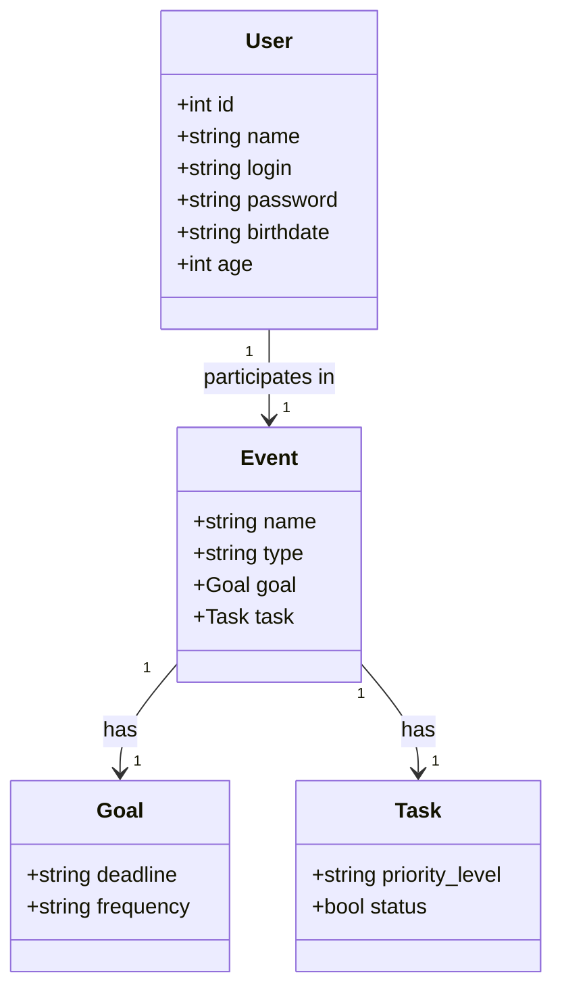

# testeAPI

## Class diagram

```mermaid
classDiagram
    class User {
        +int id
        +string name
        +string login
        +string password
        +string birthdate
        +int age
    }
    
    class Event {
        +string name
        +string type
        +Goal goal
        +Task task
    }

    class Goal {
        +string deadline
        +string frequency
    }

    class Task {
        +string priority_level
        +bool status
    }

    User "1" --> "1" Event : participates in
    Event "1" --> "1" Goal : has
    Event "1" --> "1" Task : has
```
